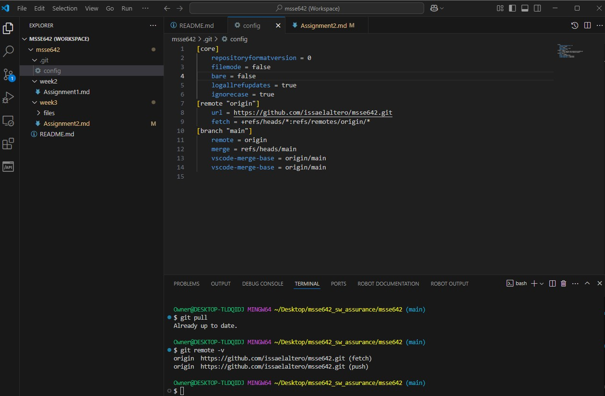
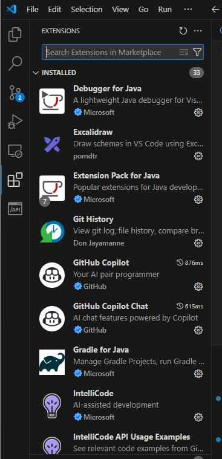
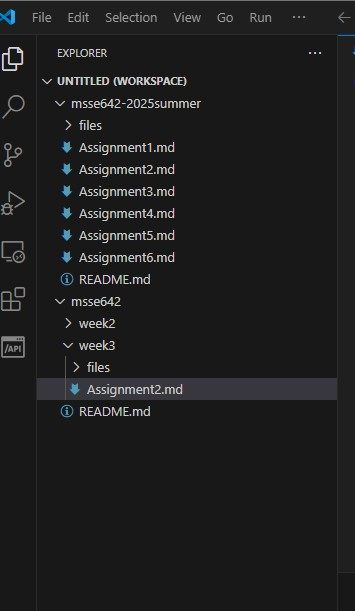
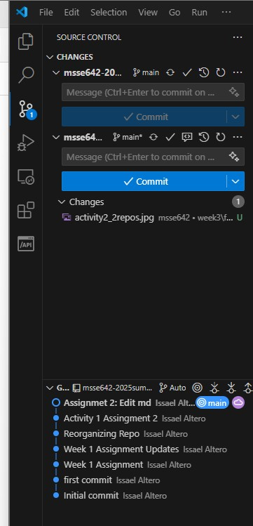
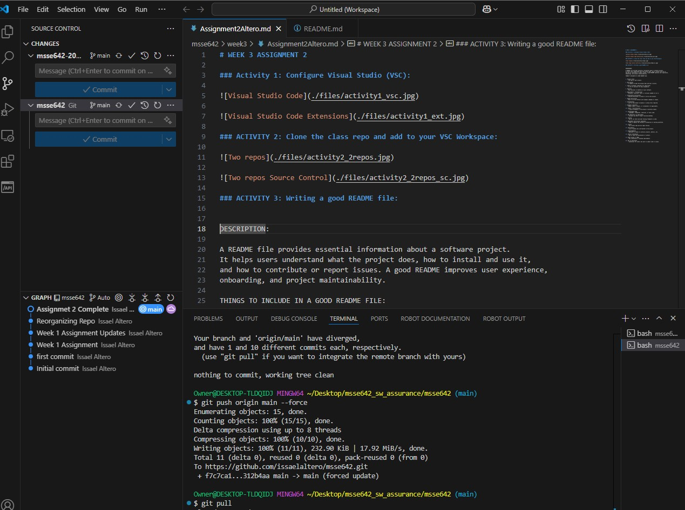

# WEEK 3 ASSIGNMENT 2

### Activity 1: Configure Visual Studio (VSC):

### ACTIVITY 2: Clone the class repo and add to your VSC Workspace:

### ACTIVITY 3: Writing a good README file:

DESCRIPTION:

A README file provides essential information about a software project. 
It helps users understand what the project does, how to install and use it, 
and how to contribute or report issues. A good README improves user experience, 
onboarding, and project maintainability.

THINGS TO INCLUDE IN A GOOD README FILE:

1. Project Title
   - The name of your project.

2. Description
   - A summary of what the project does and why it exists.

3. Table of Contents (optional for long files)
   - A list of sections for easy navigation.

4. Features
   - Key functions or benefits of your software.

5. Requirements / Prerequisites
   - Software, libraries, tools, or versions needed to run it.

6. Installation Instructions
   - Step-by-step guide to install or set up the project.

7. Usage Instructions
   - How to run the software with example commands or output.

8. Configuration
   - List of environment variables or config files required.

9. Examples (optional)
   - Sample inputs, outputs, or screenshots (if applicable).

10. Folder / File Structure
    - A quick breakdown of the project's directory layout.

11. Technologies Used
    - Languages, frameworks, libraries, or tools used.

12. API Reference (if applicable)
    - Document any APIs or major functions/methods.

13. Testing
    - How to run tests and what testing framework is used.

14. Deployment Instructions (optional)
    - Steps to deploy the software to production or hosting platforms.

15. License
    - The license type and any legal notices.

16. Contributors
    - List of people who contributed to the project.

17. Acknowledgments
    - Mentions or thanks to external projects, mentors, etc.

18. Contact Information
    - How to reach the maintainers or authors.

19. Known Issues or TODOs
    - Any limitations or planned improvements.

20. How to Contribute
    - Guidelines for others who want to submit code or issues.

