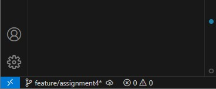
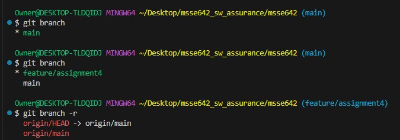
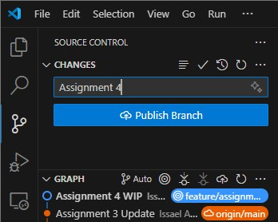

# WEEK 6 ASSIGNMENT 4

### feature/assignment4:

What is different when you run git branch and git branch -r?

| Command         | Lists                    | Scope        |
| --------------- | ------------------------ | ------------ |
| `git branch`    | Local branches           | Local only   |
| `git branch -r` | Remote-tracking branches | Remote only  |
| `git branch -a` | Both local and remote    | All branches |
