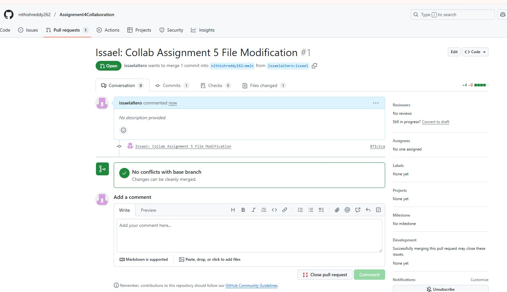

# WEEK 8 ASSIGNMENT 5

### Collab Members:

Rasiel: https://github.com/rasielote/msse642

Issael: https://github.com/issaelaltero/msse642

Nithish: https://github.com/nithishreddy262

Sree: https://github.com/mounikagarikipati/Software-Assurance/

## Creating PRs by modifying other members repos:

### Creating PR for Rasiel by cloning and creating a new Issael Branch:

Rasiel Cloned Repo:

* Note: I do not have written access to Rasiel. Therefore, I forked his repo, changed file, commit, publish Issael branch on forked repo, created PR. See below using forked repos.

### Rasiel PR:

Rasiel Forked Repo with new Issael branch:

Forked Repo PR:

### Nitish PR:

Forked Repo with new Issael branch:

Forked Repo PR:

### Sree PR:

Forked Repo with new Issael branch:

Github Issael branch:

Forked Repo PR:

## PR Merge Conflicts?

Did you run into merge conflicts?

I did. I did not have write access to another team member's repo, which I do not own.

Fix Options:

 Option 1: Fork and Push to Your Own Repo (Recommended if you don’t have access)

 Option 2: Get Permission to Push

 I created PRs with Option 1 to collab with other team members allowing me not wait for their written permissions.